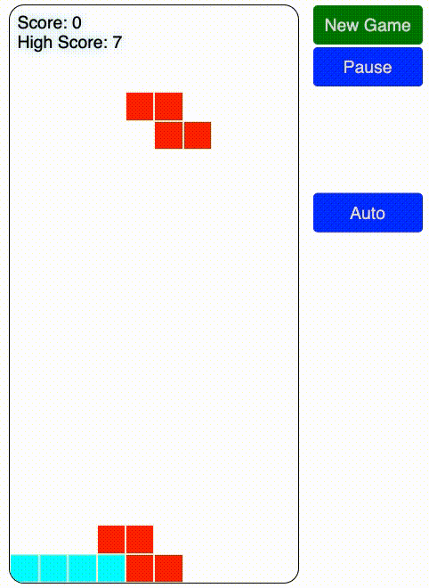

# Tetris 2023

Welcome to Tetris 2023! This game was created with the help of AI, using [ChatGPT](https://openai.com/blog/chatgpt/) to generate all the code and documentation, followed by AI-aided debugging.

To play, simply click on the [online version](https://tetris.rdancer.org/) or open `index.html` in your browser. No server is needed.

Use the left and right arrow keys to move the active piece, and the up arrow key to rotate it. You can also use the down arrow key to speed up its descent or the space bar to instantly drop the piece.

The game has an autoplay mode, activated by the *Auto* button. Encouraged by the ease with which AI practically wrote the whole game, I decided to further explore the domain by creating an AI to also play the game. This is a little bit like trying out a new powertool by building a doghouse, then proceeding to build a powertool factory next to it. Turns out ChatGPT has a limited aptitude for building machines in its likeness, so despite my best efforts the ratio flipped, and the autoplay is pretty much entirely human-authored (GitHub CoPilot has helped tremendously with idiomatic Python, library APIs, and all kinds of sweat-of-the-brow code). If you're into that kind of stuff, read more [here](ml/README.md).

We hope you have a great time playing Tetris 2023!

---

see also: [*Tetris 2025*](https://github.com/rdancer/tetris-2025)
