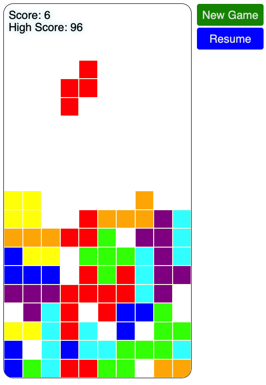

# Tetris 2023

Welcome to Tetris 2023! This game was created as an experiment to see how much support an AI could provide in the development process. All of the code and instructions for creating the game were generated by [ChatGPT](https://openai.com/blog/chatgpt/).

To get started, simply open the [index.html](index.html) file in your web browser. No server is required to run the game. You can also [play online](https://rdancer.github.io/Tetris-2023/).

To play Tetris 2023, press the **Start** button to begin the game. Use the left and right arrow keys to move the active piece, and use the down arrow key to speed up its descent. Alternatively, you can use the space bar to instantly drop the piece.

We hope you enjoy playing Tetris 2023!

